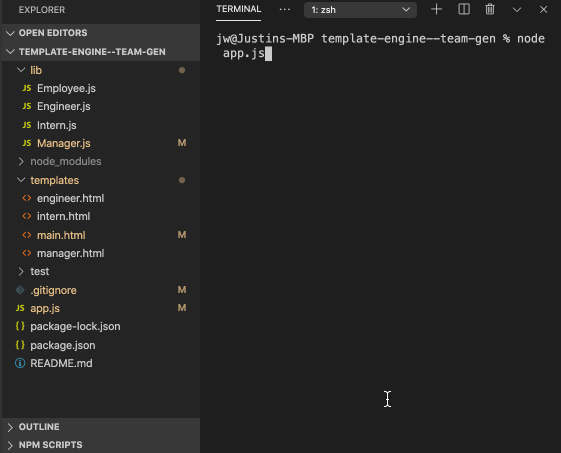
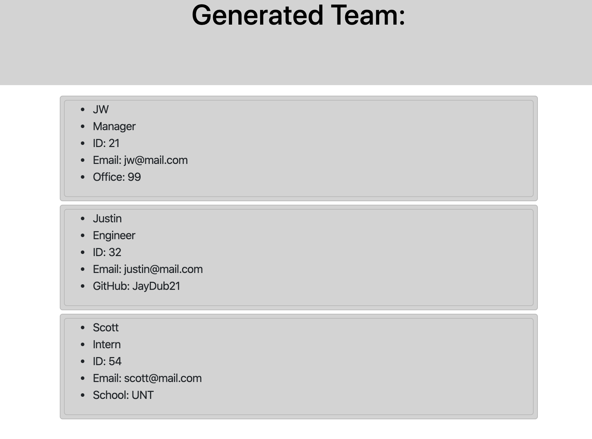

# Team Generator

##### Generate a Team to HTML by way of node.js

### How To Use:

##### Open Terminal

##### To install dependencies type:
```sh
npm install
```

###### To run application in your terminal  type: 
```sh
node app.js
``` 

##### Input Team Infomration Into Prompts

## TERMINAL EXAMPLE:


## HTML OUTPUT EXAMPLE:


##### Secondary Click the Generated HTML file
```sh
outputs.html
```

### Credits
* Will Jones
* Israel Medina